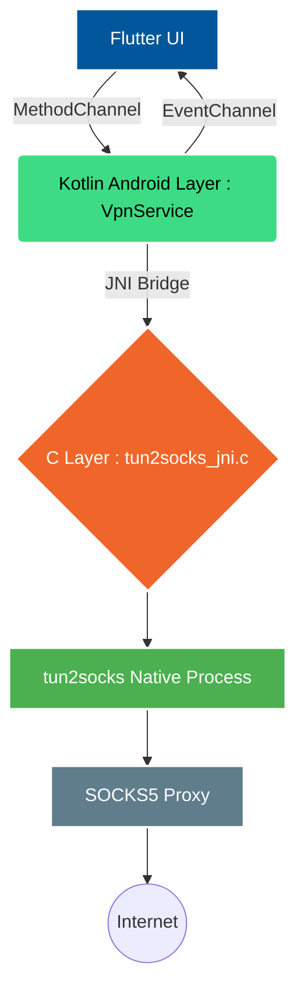

# RouteFlux VPN 
> A high-performance Flutter-based SOCKS5 proxy VPN client with native Android TUN routing via tun2socks.

## Project Overview

**RouteFlux VPN** (`com.routeflux.vpn`) is a production-grade Android VPN client designed to seamlessly route device traffic through a standard SOCKS5 proxy using a native TUN interface.

By bridging a modern Flutter UI with a robust native Android implementation (Kotlin + C/JNI) powered by **tun2socks**, RouteFlux provides reliable, system-wide proxy tunneling. This architecture ensures native integration with Android's `VpnService` API, guaranteeing a secure, leak-free, and highly performant network experience.

## Key Features

- **System-Wide SOCKS5 Proxying**: Routes all Android device traffic (TCP/UDP) through a SOCKS5 proxy.
- **Native TUN Interface**: Utilizes Android's `VpnService` API for true device-level routing.
- **tun2socks Integration**: High-performance traffic forwarding powered by the natively compiled `tun2socks` core.
- **JNI Bridge Architecture**: Seamless and efficient communication between the Flutter UI, Android Kotlin layer, and C-based tun2socks core.
- **Real-Time State Tracking**: Instant UI updates reflecting the VPN tunnel connection state via `EventChannel`.
- **DNS Routing & Leak Prevention**: Ensures DNS queries flow securely through the VPN tunnel.
- **Route Loop Prevention**: Intelligent proxy hostname resolution prior to connection to avoid infinite routing loops.
- **Production-Ready Build**: Configured with R8 and ProGuard rules for optimized and obfuscated release builds.
- **Multi-Architecture Support**: Pre-configured support for `arm64-v8a` and `armeabi-v7a` CPU architectures.

## Architecture

RouteFlux utilizes a cross-platform frontend backed by low-level native components for maximum performance and reliability.



### Flow Description
1. **Flutter UI**: The user initiates a connection, providing SOCKS5 proxy credentials.
2. **Kotlin `VpnService`**: Flutter communicates the request via `MethodChannel`. The Android layer resolves the proxy IP (preventing route loops), configures the native TUN interface, and establishes the local VPN configuration.
3. **JNI Bridge**: The native file descriptor for the TUN interface is securely passed from Kotlin to the C layer.
4. **tun2socks Core**: A native thread runs `tun2socks`, continuously reading from the TUN interface, converting raw IP packets to standard TCP/UDP streams, and routing them via the configured SOCKS5 proxy.
5. **State Management**: The C/Kotlin layers report connection status and traffic stats back to Flutter efficiently via `EventChannel`.

## Technology Stack

- **Frontend**: Flutter / Dart
- **Android Native**: Kotlin, Android `VpnService` API
- **Native Bridge**: JNI (Java Native Interface), C/C++
- **Networking Core**: tun2socks (Native binary execution)

## Project Structure

```text
routeflux_vpn/
├── android/
│   ├── app/
│   │   ├── src/main/
│   │   │   ├── kotlin/com/routeflux/vpn/   # VpnService & MethodChannel implementation
│   │   │   ├── cpp/tun2socks_jni.c         # JNI bridge exposing tun2socks to Kotlin
│   │   │   └── res/                        # Android standard resources
│   │   ├── proguard-rules.pro              # ProGuard/R8 obfuscation rules
│   │   └── build.gradle.kts                # Gradle build configuration
├── lib/
│   ├── main.dart                           # Flutter application entry point
│   └── screens/                            # Flutter UI components and state logic
└── pubspec.yaml                            # Dart package dependencies
```

## Installation & Build Instructions

### Prerequisites
- Flutter SDK (latest stable recommended)
- Android Studio (Electric Eel or newer recommended)
- Android SDK & NDK (required for JNI compilation)
- CMake (installed via Android Studio SDK Manager)

### Setup

1. **Clone the repository:**
   ```bash
   git clone https://github.com/your-username/routeflux-vpn.git
   cd routeflux-vpn
   ```

2. **Fetch dependencies:**
   ```bash
   flutter pub get
   ```

3. **Verify NDK Configuration:**
   Ensure Android Studio has successfully downloaded the NDK and CMake. The Gradle build process will automatically compile the C/JNI components.

## Running on a Device

*Note: Android's `VpnService` functionality cannot be reliably tested on standard Android Emulators due to lack of TUN interface support. A physical Android device is highly recommended.*

1. Connect your Android device via USB debugging or Wireless ADb.
2. Launch the application:
   ```bash
   flutter run -d <device_id>
   ```

## Testing the VPN Connection

1. Launch **RouteFlux VPN**.
2. Enter the details of an active SOCKS5 proxy server (IP/Hostname and port).
3. If required, provide authentication credentials.
4. Tap **Connect**.
5. Grant the standard Android VPN permission dialog when prompted.
6. Once the UI indicates a connected state, open a browser and visit [ipleak.net](https://ipleak.net) to verify that your IP address and DNS requests are successfully routing through the proxy.

## Security Notes

- **Credential Handling**: SOCKS5 credentials (when used) are passed securely from Flutter memory to the native layer. For persistence, ensure secure storage mechanisms (e.g., `flutter_secure_storage`) are implemented.
- **Route Constraints**: The application resolves the proxy server hostname to an IP address *before* establishing the TUN interface to exclude the proxy traffic itself from the tunnel, preventing catastrophic routing loops.
- **Release Optimization**: Release builds utilize R8/ProGuard. Crucial native bindings and JNI methods are protected in `proguard-rules.pro` to ensure stability post-obfuscation.

## Roadmap & Future Features

- [ ] Support for application-level Split Tunneling
- [ ] Implement robust auto-reconnect and watchdog logic
- [ ] Support for UDP associate in SOCKS5 configurations
- [ ] Persistent Android foreground notification with quick-action toggles
- [ ] Integration with alternative protocols (Shadowsocks, Trojan)

## Screenshots

*(Placeholder: Add high-quality application screenshots here)*
<br>
<p align="center">
  
  &nbsp;&nbsp;&nbsp;
  
  &nbsp;&nbsp;&nbsp;
  
</p>

## Contributing

We welcome community contributions. To contribute:

1. Fork the repository
2. Create your feature branch (`git checkout -b feature/AmazingFeature`)
3. Commit your changes (`git commit -m 'Add some AmazingFeature'`)
4. Push to the branch (`git push origin feature/AmazingFeature`)
5. Open a Pull Request

Please ensure your code complies with standard Flutter `analysis_options.yaml` rules.

## License

This project is licensed under the MIT License - see the `LICENSE` file for details.

## Author

**[Moiz-Ali-Moomin]**
- GitHub: [@Moiz-Ali-Moomin](https://github.com/Moiz-Ali-Moomin/routeflux-vpn)
- Twitter: [@MoizAliMoomin](https://twitter.com/MoizAliMoomin)

---
*Built with Flutter & Native Android Networking*
